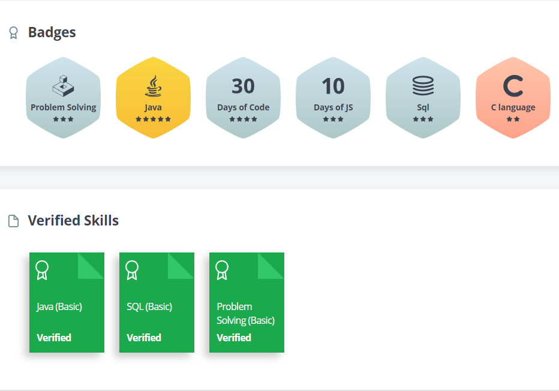
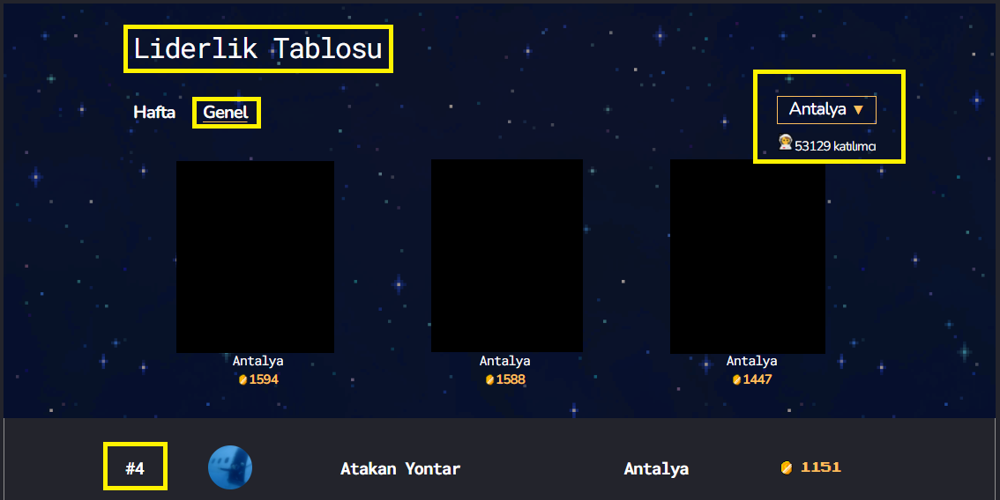
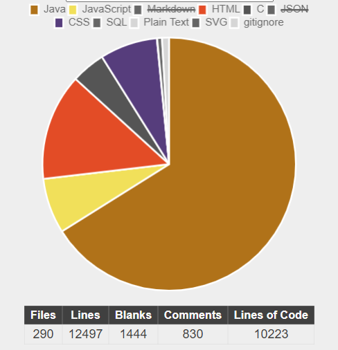

# Programming-Study
- Current HackerRank achievements:
  
- Ranked 4th in Antalya on Patika.Dev:
  
  **Note:** There are over 53 thousand users all around Turkey and for the moment I am the **49th** out of them.  
- Stars on my CodingBat account: 
  
- My repository statistics(I used [Count Log](https://codetabs.com/count-loc/count-loc-online.html)): 
  
  **Note:** Pure code lines without JSON, markdown, and comment lines are over 6000 lines. 
